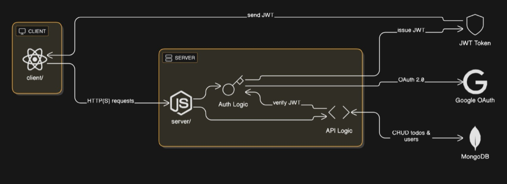

TODO List App (DoBuddy) 
(React + Node.js + Express.js + MongoDB)

This is a full-stack Todo List web application built using **React.js**, **Node.js**, **Express.js**, **MongoDB**, and **OAuth 2.0 Google Authentication**. 
It enables users to log in with Google, manage tasks (add, update, delete), and ensures secure access using JWT-based session handling.

 Live Demo

 [Deployed App on Vercel](https://todo-list-using-react-nodejs-mongod.vercel.app)
 [Deployed App on Render](https://todo-list-using-react-nodejs-mongodb.onrender.com)
 [Loom Video Walkthrough](https://www.loom.com/share/c5f15c4d843b484cbc14b1d98418833a?sid=afe8bfc6-37b8-43dc-9f34-ecfc03c96411)
 

 Tech Stack

- Frontend:React.js (client/)
- Backend: Node.js + Express.js (server/)
- Authentication: Google OAuth 2.0
- Authorization: JSON Web Tokens (JWT)
- Database:MongoDB (Mongoose)
- Deployment: Vercel (frontend), Render (backend assumed)


 Project Structure


├── client/              # React frontend
│   ├── components/      # UI components
│   ├── pages/           # Login, Dashboard
│   └── App.js           
├── server/              # Node.js backend
│   ├── routes/          # API routes
│   ├── models/          # Mongoose models
│   ├── auth/            # Google OAuth setup
│   └── server.js        
└── README.md


 Features:

* 🔐 Google OAuth Login
* 🔑 JWT-based session handling
* ➕ Add tasks
* ✅ Mark tasks as done
* 🗑️ Delete tasks
* ✏️ Update tasks
* 👥 User data stored in MongoDB
* 📦 Clean modular backend code


## ⚙️ How to Run Locally

### 1. Clone the Repo

```bash
git clone https://github.com/Shruthimoorthi/TODO_LIST_USING_REACT_NODEJS_MONGODB.git
cd TODO_LIST_USING_REACT_NODEJS_MONGODB
```

### 2. Setup Backend

```bash
cd server
npm install
# Create a .env file with the following:
# GOOGLE_CLIENT_ID=your_google_client_id
# GOOGLE_CLIENT_SECRET=your_google_secret
# JWT_SECRET=your_jwt_secret
# MONGO_URI=your_mongodb_connection_string
node server.js
```

### 3. Setup Frontend

```bash
cd ../client
npm install
npm start
```

---

## 🧠 Architecture Diagram




## 📌 Assumptions

* HTTPS is used for all client-server interactions in production.
* JWT tokens are stored securely and sent via `Authorization` header.
* The MongoDB connection is secured using an `.env` file and Atlas.

---

## 📈 Future Improvements

* Add support for dark mode.
* Add categories for tasks.
* Add user profile management.

---


“This project is a part of a hackathon run by
https://www.katomaran.com ”


---

```

Let me know if you want me to automatically push this into your GitHub or generate a `.md` file version for download.
```
